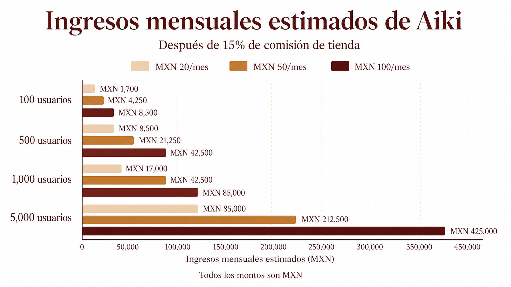
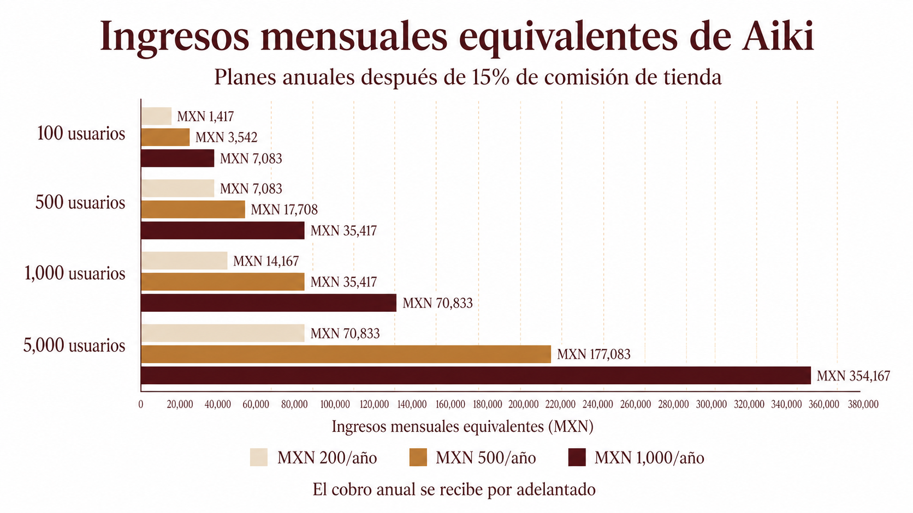
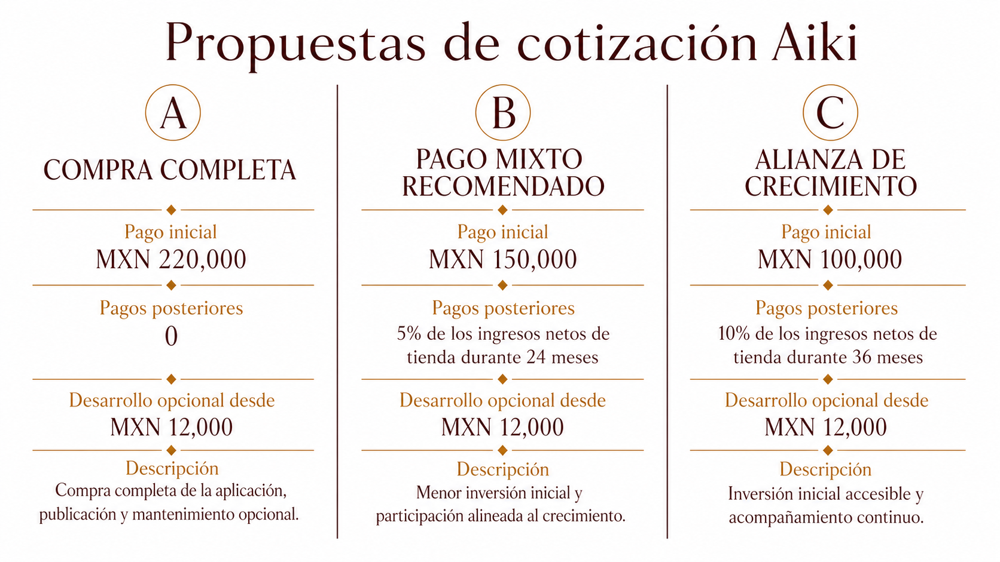
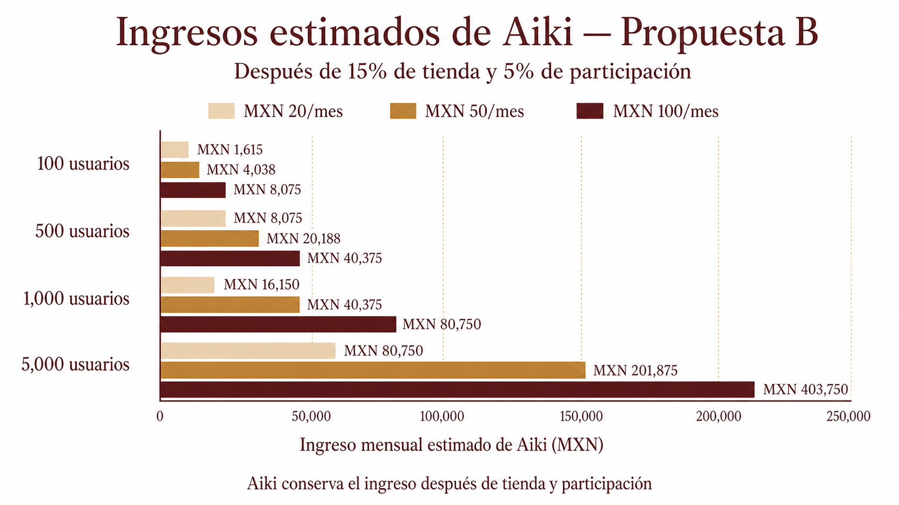
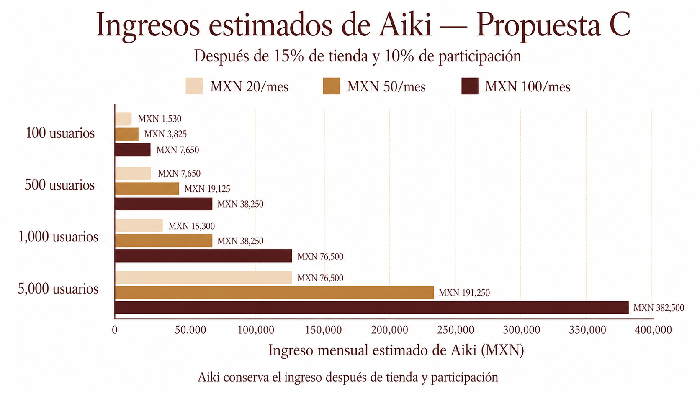

# Aiki Contigo: oportunidad de ingresos y cotización

<nav class="aiki-index" aria-label="Índice">
  <h2>Índice</h2>
  <ol>
    <li><a href="#introduccion">Introducción</a></li>
    <li><a href="#oportunidad-de-ingresos">Oportunidad de ingresos</a></li>
    <li><a href="#ingresos-mensuales-estimados">Ingresos mensuales estimados</a></li>
    <li><a href="#propuestas-de-cotizacion">Propuestas de cotización</a></li>
    <li><a href="#desarrollos-nuevos-opcionales">Desarrollos nuevos opcionales</a></li>
  </ol>
</nav>

## Introducción

Aiki Contigo puede convertirse en una herramienta importante para ayudar a más personas a hacer conciencia, encontrar calma y construir hábitos de bienestar.

La aplicación reúne en un solo lugar:

- Contenido de audio y video.
- Meditaciones y ejercicios de bienestar.
- Seguimiento de progreso, minutos y rachas.
- Descarga para ver sin conexión con suscripción.
- Check-in emocional y estadísticas personales.
- Notificaciones para mantener el acompañamiento.
- Administración de contenido y usuarios para Aiki.

Con un buen enfoque de contenido, comunicación y crecimiento, Aiki podría aumentar su alcance, reputación e impacto. El celular es el principal medio de acceso de esta época: permite que la ayuda de Aiki acompañe a las personas en cualquier momento y lugar.

## Oportunidad de ingresos

### Precios propuestos para los usuarios

- **Plan mensual:** MXN 20, MXN 50 o MXN 100.
- **Plan anual:** MXN 200, MXN 500 o MXN 1,000.

El plan de MXN 100 al mes se representa con un supuesto anual de MXN 1,000 al año.

Los siguientes números consideran **usuarios que sí pagan**, no solamente personas que descargan la aplicación.

### Comisiones actuales de las tiendas

Comisión de referencia del **15%**:

- Aiki recibiría aproximadamente **85% del precio** antes de impuestos, soporte e infraestructura.
- Google Play publica 15% para suscripciones que se renuevan automáticamente.
- Apple entrega 85% cuando aplica el programa Small Business o después de un año de servicio pagado. Si no aplica el programa, durante el primer año puede entregar 70%.

Fuentes: [Google Play](https://support.google.com/googleplay/android-developer/answer/112622?hl=en), [Apple Subscriptions](https://developer.apple.com/app-store/subscriptions/) y [Apple Small Business](https://developer.apple.com/go/?id=app-store-small-business-program).

## Ingresos mensuales estimados

La gráfica muestra el ingreso mensual estimado después de una comisión de tienda del 15%, según el número de usuarios que pagan.

### Si se ofrece un plan anual

El plan anual recibe el dinero por adelantado, pero aquí se muestra como equivalente mensual para compararlo con el plan mensual.

Aiki puede convertirse en un canal permanente para extender su mensaje y acompañar a más personas.

La oportunidad económica depende principalmente de tres cosas:

1. Que el contenido se actualice y mantenga el interés.
2. Que las personas encuentren valor suficiente para seguir pagando.
3. Que Aiki comunique y promueva la aplicación de forma constante.

Con una estrategia sólida, Aiki podría crecer en alcance, reputación, impacto y sostenibilidad económica.

> Las cantidades son escenarios de planeación, no una garantía de ingresos. La comisión real puede variar según la tienda, el programa aplicable, impuestos y condiciones de cada cuenta.

## Propuestas de cotización

### Ingresos estimados de Aiki con la propuesta B

Reduce el pago inicial y se alinean los pagos posteriores al éxito de la aplicación.

### Ingresos estimados de Aiki con la propuesta C

Reduce todavía más el pago inicial, pero aumenta la participación y el periodo durante el cual se calcula el porcentaje.

## Desarrollos nuevos opcionales

**Desde MXN 12,000 por desarrollo o mejora**, más los costos directos de Supabase, cuentas de tienda y otros servicios.

Este importe aplica para nuevas funciones, cambios especiales y mejoras que Aiki quiera agregar después. Por ahora queda separado de los pagos posteriores de las propuestas B y C.

La supervisión y el mantenimiento continuo pueden definirse más adelante como un servicio mensual independiente, si Aiki lo necesita.
